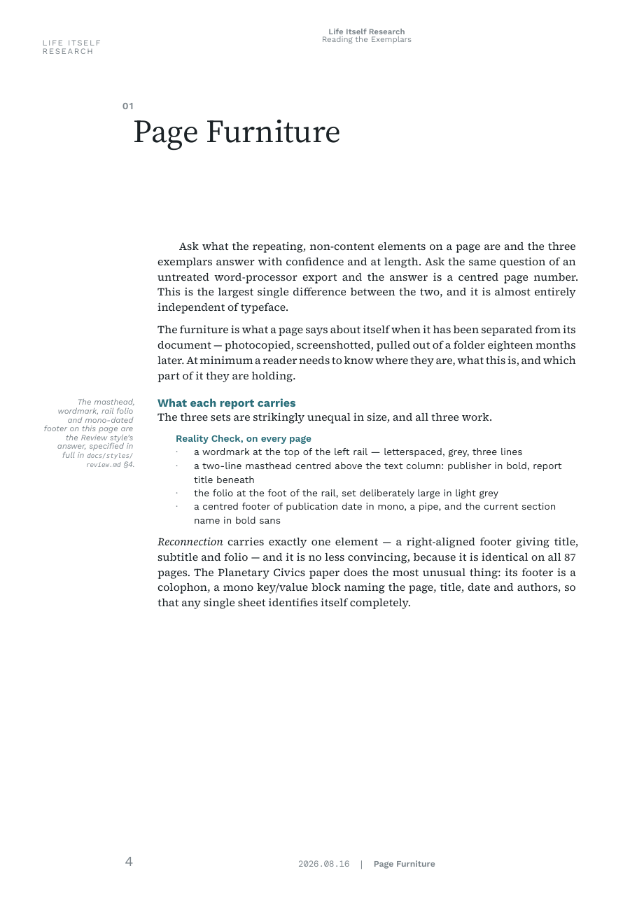
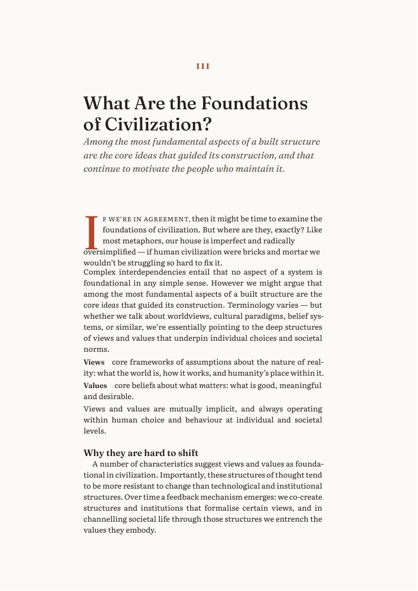
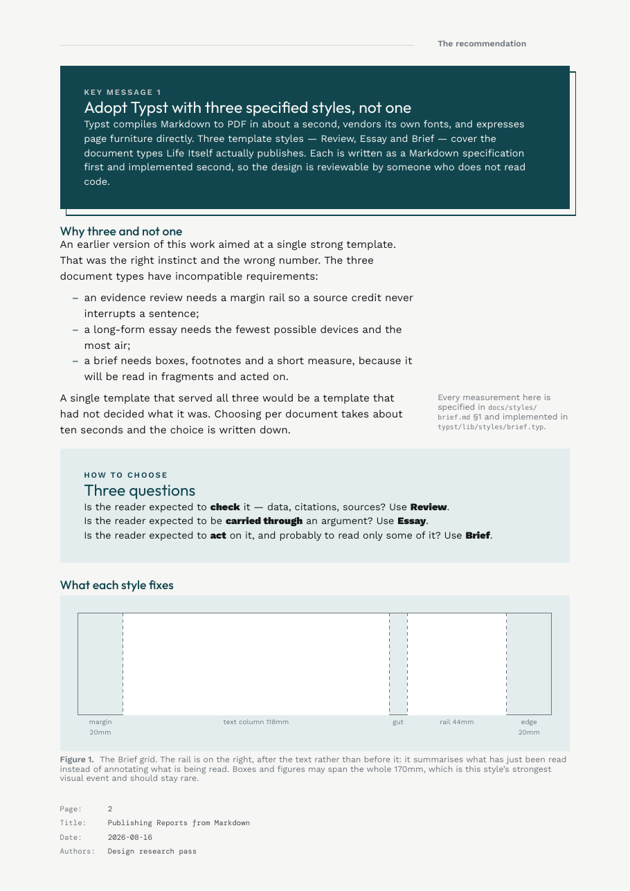

# Changelog

All notable work on this prototype, dated, most recent first.

## 2026-08-16 — shipping the essay

**Added**
- `typst/build.sh` now takes an engine argument and defaults to `essay`,
  building `output/what-is-2r.pdf` — the whole 41pp essay through
  `typst/lib/styles/essay.typ`. `./build.sh v3` still runs the superseded
  single-template engine until this is signed off.
- `scripts/editorial.py` and `source/what-is-2r.editorial.txt` — standfirst
  and pull-quote marks, kept in a sidecar rather than inline because the
  source is a Google Docs export that gets re-exported, which wipes
  anything hand-edited into it. The sidecar *names* a sentence rather than
  copying it, so a lifted quote is verbatim by construction and a mark that
  no longer matches fails the build. Proposals for all 16 chapters ship
  commented out; all 29 verified to resolve against the source.
- Issues [#1](https://github.com/life-itself/pdf-report-publishing/issues/1)
  (editorial pass) and
  [#2](https://github.com/life-itself/pdf-report-publishing/issues/2)
  (bold-line section labels, paradigm triads).

**Fixed**
- Chapter openers emitted no trailing air of their own, relying on a
  standfirst or drop-capped opening to provide it. Fourteen of the essay's
  sixteen chapters have neither, so their titles butted straight into the
  body. Found by porting the real document — the three example PDFs all
  happened to use the devices.
- `split_chapters` missed any chapter whose heading followed a
  `#pagebreak()` raw block with no blank line between, which is four of
  them in this source.

**Measured**
- Only 2 of 16 chapters have a syntactically detectable standfirst, and of
  six inline bold runs of 6+ words in the whole essay, one is a plausible
  pull quote. The usual "the author already bolded what matters" heuristic
  does not work here — which is why the marks are explicit rather than
  inferred.

## 2026-08-16 — template styles

The reframe agreed at the end of the v3 session: stop iterating on one
design, extract the exemplars' principles into documentation, and express
them as two or three template styles written as Markdown specs and then
implemented. The deliverable is the extracted principles; the Typst is the
proof that they are implementable.

**Researched**
- Read ~30 pages across the three exemplar PDFs at the level of structure
  and page furniture rather than fonts, and wrote up
  `docs/report-design-principles.md`: ten principles, each cited to a page
  you can open. The largest finding is that **page furniture** — masthead,
  rail, folio, running foot, colophon — is what separates a report from a
  Word document, and that our template had a folio and nothing else.
- Corrected the previous session's claim that all three exemplars justify.
  Only CRI does; the two ragged ones are the two sans ones. The real rule
  is that justification needs a serif, hyphenation and a decent measure.

**Added**
- `docs/styles/{review,essay,brief}.md` — three full specifications: grid
  in millimetres, type scale in points, palette with a named job per
  colour, page furniture, structural elements, setting rules, and an
  explicit list of what would break each style.
- `typst/lib/styles/{review,essay,brief}.typ` — each spec implemented, and
  `typst/lib/util.typ` for the small amount of genuinely shared technique.
- One example PDF per style, each built from **real content**: the
  exemplar research (Review), three chapters of the 2R essay (Essay), and
  the actual recommendation coming out of this project (Brief). A specimen
  made of placeholder text proves nothing about how a style handles
  argument, citation and apparatus.
- A real drop cap, built by measuring a capital's cap-height and
  binary-searching how many words fit beside it — Typst has no
  text-wrap-around-shape.
- `docs/typst-cookbook.md` filled out from a stub into a working
  reference, including measured leading-to-line-height constants per
  vendored family.
- `skills/pdf-report/SKILL.md` — the wrapper: choose a style, read its
  spec, build, then do the editorial pass.
- Vendored Fraunces Italic and DM Mono (both OFL).

**Fixed**
- The type specimen, on both counts. `typst/specimen.typ` varied only the
  fonts across its four pages — asking for a judgement about a design
  while holding colour, furniture and layout fixed — and it drew its own
  preset label into the page footer, overriding the real footer and making
  the page furniture invisible. Replaced by `typst/compare.typ`, which
  renders the same content through each style's real `report()` function
  so every page carries its genuine furniture, and puts each style's name
  on its own page in that style's own palette and display face.

**Decided**
- Three styles, not one. The three document types have incompatible
  requirements — a review needs a source rail, an essay needs the fewest
  devices and the most air, a brief needs boxes and footnotes — and a
  single template serving all three would be a template that had not
  decided what it was.
- Palette and type are chosen per style and are brand-independent, derived
  from what each exemplar demonstrated rather than from the Life Itself
  brand. The inherited brown ink is gone.

## 2026-08-16

Template v3 — a typesetting pass, per `NEXT.md`. The plumbing was already
working; this session was about why the output read as "OK" rather than
high-class.

**Researched**
- Pulled the three actual report PDFs off Rufus's Are.na board and read
  their fonts out with `pdffonts`: CRI *Reality Check* (Freight Text Pro +
  Freight Sans), The Mindfulness Initiative *Reconnection* (Oxygen + ITC
  Avant Garde), PCI *Planetary Futures* (Inter + DM Mono). Written up in
  `docs/typography-research.md` — the short version is that the ones that
  read as high-class all use a **serif body with the sans confined to
  headings and furniture**, all **justify and hyphenate**, all treat
  images as composed **figures**, and all **use the wide margin for
  something**.

**Added**
- `fonts/` — seven open-licence families vendored with their OFL texts,
  so the build no longer depends on what's installed on the machine. It
  previously fell back to Liberation Sans in the original sandbox and to
  a system serif on macOS, i.e. produced two different PDFs from the same
  source.
- `typst/theme.typ` — four type presets (`warm`, `editorial`, `modern`,
  `display`), each pairing a serif body with a display face and carrying
  its own size/leading.
- `typst/specimen.typ` → `output/type-specimen.pdf` — the same real page
  of the essay rendered once per preset, through the same code path the
  report uses, so the pairing can be chosen by looking at it.
- `scripts/figures.py` — reconstructs figures from the export's bare
  images: captions, numbering, widths derived from the images' own pixel
  dimensions, and a **row form** for image sequences. The
  Cimabue/Perugino/Picasso trio now sets as one three-panel figure with
  equal-height panels instead of three stacked full-width images.
- `scripts/quotes.py` + a `blockquote()` device — the essay's four long
  quotations were typed as italic paragraphs, which the template was
  rendering as body-sized rose italic (the worst-looking thing in v2).
  They now set as proper block quotations with a hung quotation mark and
  a sans attribution.
- `scripts/definitions.py` + a `dfn()` device — chapter 11's six
  principles were typed as `» **Term**` with the description beneath, and
  rendered as six bold-then-text lumps with the `»` still visible. They
  now set as a proper definition list. (Unlike the other bold-line
  conventions in the export, this marker is unambiguous, so converting it
  needed no guesswork — see README "Known gaps".)
- `pullquote()`, `standfirst()` and `note()` devices, available but not
  yet used in this essay — see `NEXT.md`.

**Changed**
- Body is now serif; the sans is used only for headings and furniture.
- Text is justified and hyphenated (headings explicitly not hyphenated —
  v3's first build produced "PARADIG-MATIC", which is the most obvious
  tell of an unattended template).
- The wide left margin became a **32mm working margin column** carrying
  figure numbers, captions, chapter numbers and folios. Previously it was
  5.3cm of nothing, which reads as a mistake rather than as generosity.
- Body ink darkened `#3A2C2B` → `#2E2422`; it was washed out at serif
  text sizes.
- Paragraph spacing opened up; the v3 first build ran paragraphs together
  into a single slab.

**Fixed**
- Chapter numbers rendered as `016` for chapter 16 — Typst's numbering
  patterns treat a leading `0` as a literal character, so `display("01")`
  prefixes rather than pads.
- `typst/build.sh` had the original sandbox's `/home/user/tools` paths
  hardcoded and didn't run anywhere else.

## 2026-08-15

First working pass at the Markdown → PDF pipeline
([life-itself/community#1269](https://github.com/life-itself/community/issues/1269)),
using the ["What is 2R?"](https://github.com/life-itself/2rbook/blob/main/what-is-2r/essay.md)
essay as a real test document.

**Added**
- Two candidate pipelines: Pandoc+LaTeX (via Tectonic) and Pandoc+Typst.
  Both build clean from the same cleaned Markdown source.
- `scripts/clean.py` — turns the essay's raw Google-Docs export into
  proper Markdown: strips the manual hyperlinked TOC, un-escapes
  Google-Docs punctuation, reconstructs the real two-level heading
  structure (`N.` chapters vs `N.M` subsections — the export had
  flattened both to one level), and preserves the source's manual page
  breaks instead of discarding them.
- Downloaded Rufus's reference PDF (a designer-typeset version of the
  same essay) and matched the Typst template against it directly:
  sampled its colours (maroon headings, dusty-rose italics, warm brown
  body ink), its sans-serif-throughout type treatment, asymmetric
  margins, and footer-only pagination.
- Cover now uses the reference artwork full-bleed (gold sun, swallows,
  botanical illustration) rather than a recreation — an earlier attempt
  to rebuild it from logo + text + cropped illustration pieces looked
  flat, then collided text with artwork, because the two occupy
  overlapping regions of the source image.
- New title/colophon page (page 2): title, subtitle, authors, draft
  date, and a copyright/licence line (placeholder text — needs a real
  decision, see `NEXT.md`).
- Confirmed Typst has native footnote (`#footnote[...]`) and
  bibliography/citation (`#bibliography()`, `#cite()`) support — no
  packages needed — with a standalone test document.

**Decided**
- Going with **Typst** over Pandoc+LaTeX: faster iteration, more
  approachable for non-technical collaborators, and covers what we
  thought might need LaTeX (footnotes, bibliographies) natively. The
  LaTeX pipeline is left working in `pandoc-latex/` as a fallback, not
  getting further design investment.

**Known gaps** — see `NEXT.md` for what's next.
