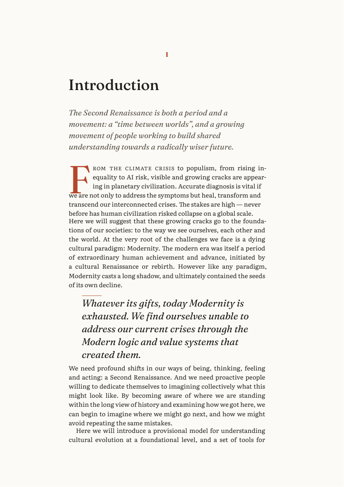
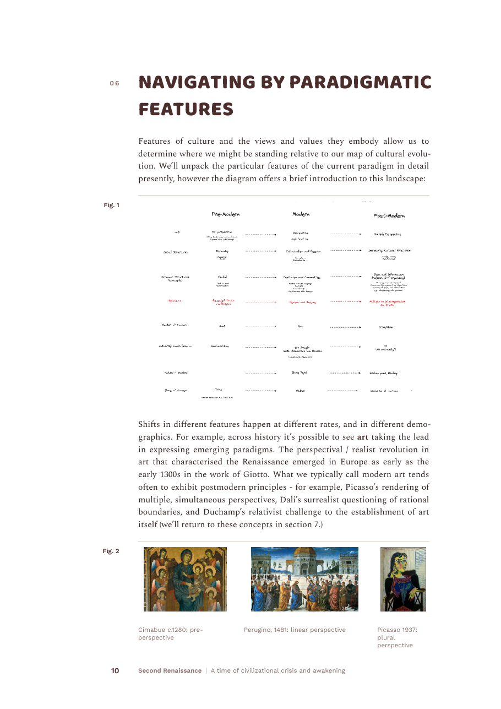
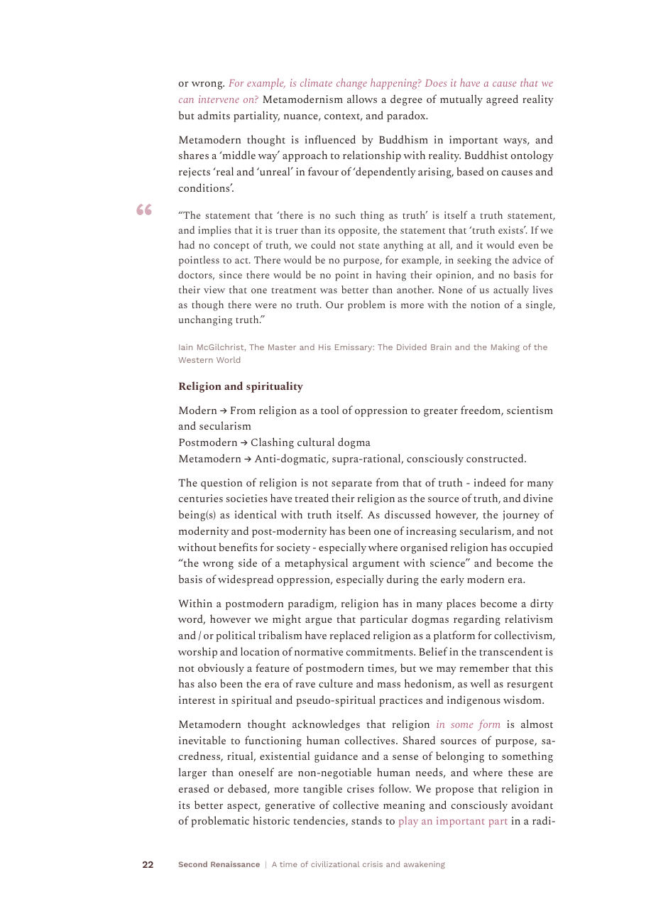
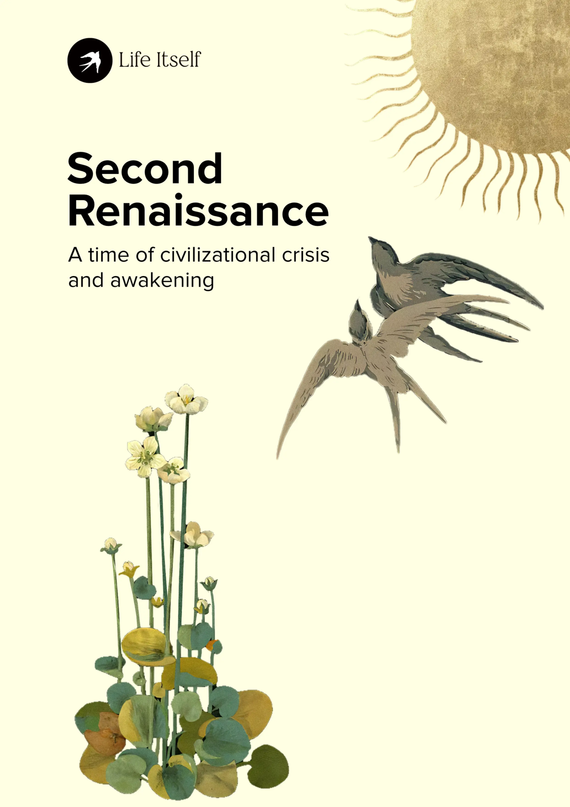
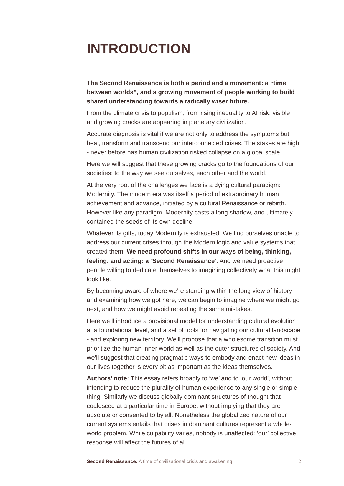

# Changelog

All notable work on this prototype, dated, most recent first.

## 2026-08-21 — Repo housekeeping

Adopted the shared changelog convention, and restructured `NEXT.md` around who
owns what so anyone picking the project up can tell at a glance which decisions
are waiting on a human and which work can just be started.

## 2026-08-16 — Three report styles, and the 2R essay set in one of them

Read three well-typeset published reports page by page and wrote up what makes
them work — the finding being that page furniture, not typeface, is what
separates a report from a Word document. Turned that into three template styles
(Review, Essay, Brief), each specified in Markdown first and implemented in
Typst second, with an example PDF apiece so the specs are checkable rather than
asserted.

The "What is the Second Renaissance?" essay now builds end to end in the Essay
style — 41 pages, cover through appendix. What it still lacks is the editorial
pass: standfirsts and pull quotes have to be chosen by a person, so the marks
live in a sidecar file with a proposal waiting against every chapter.

## 2026-08-16

Template v3 — a typesetting pass, per `NEXT.md`. The plumbing was already
working; this session was about why the output read as "OK" rather than
high-class.

**Researched**
- Pulled the three actual report PDFs off Rufus's Are.na board and read
  their fonts out with `pdffonts`: CRI *Reality Check* (Freight Text Pro +
  Freight Sans), The Mindfulness Initiative *Reconnection* (Oxygen + ITC
  Avant Garde), PCI *Planetary Futures* (Inter + DM Mono). Written up in
  `docs/typography-research.md` — the short version is that the ones that
  read as high-class all use a **serif body with the sans confined to
  headings and furniture**, all **justify and hyphenate**, all treat
  images as composed **figures**, and all **use the wide margin for
  something**.

**Added**
- `fonts/` — seven open-licence families vendored with their OFL texts,
  so the build no longer depends on what's installed on the machine. It
  previously fell back to Liberation Sans in the original sandbox and to
  a system serif on macOS, i.e. produced two different PDFs from the same
  source.
- `typst/theme.typ` — four type presets (`warm`, `editorial`, `modern`,
  `display`), each pairing a serif body with a display face and carrying
  its own size/leading.
- `typst/specimen.typ` → `output/type-specimen.pdf` — the same real page
  of the essay rendered once per preset, through the same code path the
  report uses, so the pairing can be chosen by looking at it.
- `scripts/figures.py` — reconstructs figures from the export's bare
  images: captions, numbering, widths derived from the images' own pixel
  dimensions, and a **row form** for image sequences. The
  Cimabue/Perugino/Picasso trio now sets as one three-panel figure with
  equal-height panels instead of three stacked full-width images.
- `scripts/quotes.py` + a `blockquote()` device — the essay's four long
  quotations were typed as italic paragraphs, which the template was
  rendering as body-sized rose italic (the worst-looking thing in v2).
  They now set as proper block quotations with a hung quotation mark and
  a sans attribution.
- `scripts/definitions.py` + a `dfn()` device — chapter 11's six
  principles were typed as `» **Term**` with the description beneath, and
  rendered as six bold-then-text lumps with the `»` still visible. They
  now set as a proper definition list. (Unlike the other bold-line
  conventions in the export, this marker is unambiguous, so converting it
  needed no guesswork — see README "Known gaps".)
- `pullquote()`, `standfirst()` and `note()` devices, available but not
  yet used in this essay — see `NEXT.md`.

**Changed**
- Body is now serif; the sans is used only for headings and furniture.
- Text is justified and hyphenated (headings explicitly not hyphenated —
  v3's first build produced "PARADIG-MATIC", which is the most obvious
  tell of an unattended template).
- The wide left margin became a **32mm working margin column** carrying
  figure numbers, captions, chapter numbers and folios. Previously it was
  5.3cm of nothing, which reads as a mistake rather than as generosity.
- Body ink darkened `#3A2C2B` → `#2E2422`; it was washed out at serif
  text sizes.
- Paragraph spacing opened up; the v3 first build ran paragraphs together
  into a single slab.

**Fixed**
- Chapter numbers rendered as `016` for chapter 16 — Typst's numbering
  patterns treat a leading `0` as a literal character, so `display("01")`
  prefixes rather than pads.
- `typst/build.sh` had the original sandbox's `/home/user/tools` paths
  hardcoded and didn't run anywhere else.

## 2026-08-15

First working pass at the Markdown → PDF pipeline
([life-itself/community#1269](https://github.com/life-itself/community/issues/1269)),
using the ["What is 2R?"](https://github.com/life-itself/2rbook/blob/main/what-is-2r/essay.md)
essay as a real test document.

**Added**
- Two candidate pipelines: Pandoc+LaTeX (via Tectonic) and Pandoc+Typst.
  Both build clean from the same cleaned Markdown source.
- `scripts/clean.py` — turns the essay's raw Google-Docs export into
  proper Markdown: strips the manual hyperlinked TOC, un-escapes
  Google-Docs punctuation, reconstructs the real two-level heading
  structure (`N.` chapters vs `N.M` subsections — the export had
  flattened both to one level), and preserves the source's manual page
  breaks instead of discarding them.
- Downloaded Rufus's reference PDF (a designer-typeset version of the
  same essay) and matched the Typst template against it directly:
  sampled its colours (maroon headings, dusty-rose italics, warm brown
  body ink), its sans-serif-throughout type treatment, asymmetric
  margins, and footer-only pagination.
- Cover now uses the reference artwork full-bleed (gold sun, swallows,
  botanical illustration) rather than a recreation — an earlier attempt
  to rebuild it from logo + text + cropped illustration pieces looked
  flat, then collided text with artwork, because the two occupy
  overlapping regions of the source image.
- New title/colophon page (page 2): title, subtitle, authors, draft
  date, and a copyright/licence line (placeholder text — needs a real
  decision, see `NEXT.md`).
- Confirmed Typst has native footnote (`#footnote[...]`) and
  bibliography/citation (`#bibliography()`, `#cite()`) support — no
  packages needed — with a standalone test document.

**Decided**
- Going with **Typst** over Pandoc+LaTeX: faster iteration, more
  approachable for non-technical collaborators, and covers what we
  thought might need LaTeX (footnotes, bibliographies) natively. The
  LaTeX pipeline is left working in `pandoc-latex/` as a fallback, not
  getting further design investment.

**Known gaps** — see `NEXT.md` for what's next.
