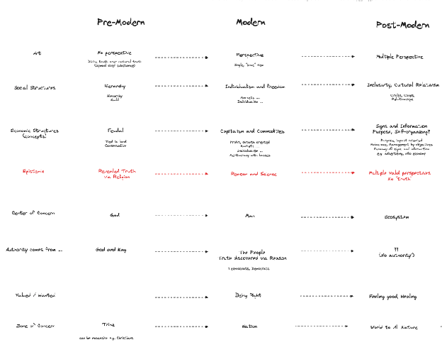
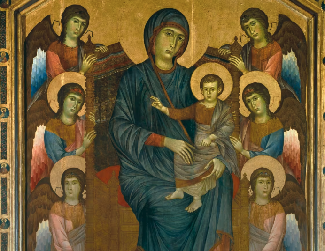
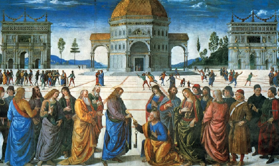
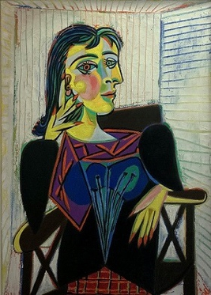
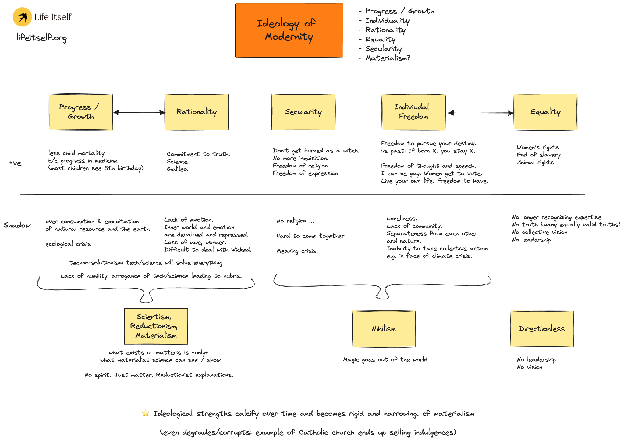
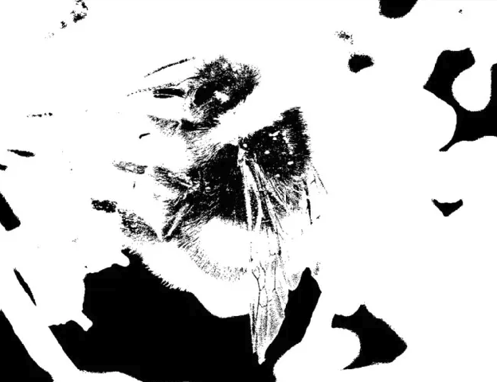
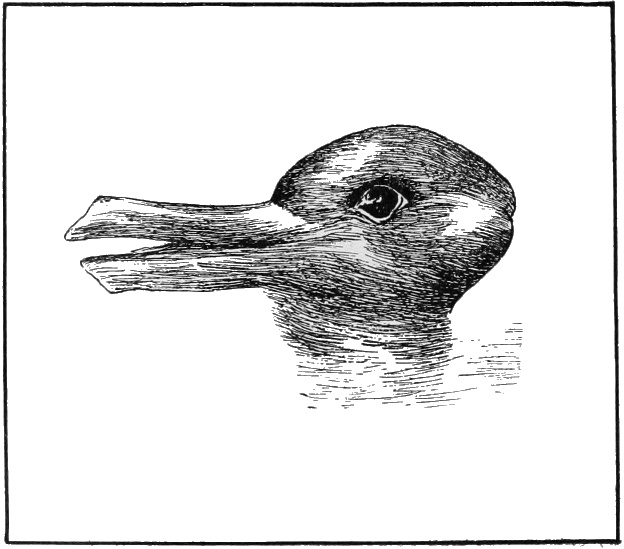

# Introduction

**The Second Renaissance is both a period and a movement: a "time between worlds", and a growing movement of people working to build shared understanding towards a radically wiser future.**

From the climate crisis to populism, from rising inequality to AI risk, visible and growing cracks are appearing in planetary civilization.

Accurate diagnosis is vital if we are not only to address the symptoms but heal, transform and transcend our interconnected crises. The stakes are high - never before has human civilization risked collapse on a global scale. 

Here we will suggest that these growing cracks go to the foundations of our societies: to the way we see ourselves, each other and the world.

At the very root of the challenges we face is a dying cultural paradigm: Modernity. The modern era was itself a period of extraordinary human achievement and advance, initiated by a cultural Renaissance or rebirth. However like any paradigm, Modernity casts a long shadow, and ultimately contained the seeds of its own decline.

Whatever its gifts, today Modernity is exhausted. We find ourselves unable to address our current crises through the Modern logic and value systems that created them. **We need profound shifts in our ways of being, thinking, feeling, and acting: a ‘Second Renaissance’**. And we need proactive people willing to dedicate themselves to imagining collectively what this might look like.

By becoming aware of where we’re standing within the long view of history and examining how we got here, we can begin to imagine where we might go next, and how we might avoid repeating the same mistakes.

Here we’ll introduce a provisional model for understanding cultural evolution at a foundational level, and a set of tools for navigating our cultural landscape - and exploring new territory. We’ll propose that a wholesome transition must prioritize the human inner world as well as the outer structures of society. And we’ll suggest that creating pragmatic ways to embody and enact new ideas in our lives together is every bit as important as the ideas themselves.

**Authors’ note:** This essay refers broadly to ‘we’ and to ‘our world’, without intending to reduce the plurality of human experience to any single or simple thing. Similarly we discuss globally dominant structures of thought that coalesced at a particular time in Europe, without implying that they are absolute or consented to by all. Nonetheless the globalized nature of our current systems entails that crises in dominant cultures represent a whole-world problem. While culpability varies, nobody is unaffected: ‘our’ collective response will affect the futures of all.

Likewise, we have adopted the imperfect term “Second Renaissance’ in the understanding that no one term will universally feel appropriate, or do justice to the variety of transformation taking place. In particular, we recognize the eurocentric nature of the term (and frame) ‘Renaissance’ – and encourage readers, if they wish, to substitute a term more relevant to their own cultural context. 

At the same time, the term renaissance has certain useful resonances. The current dominant cultural paradigm of modernity was born in the first renaissance in Europe – though we emphasize that this next transition will have many roots all over the world. In addition, the basic meaning of the term – “rebirth” – seems appropriate to this “time between worlds” and offers a framing of possibility whilst also implicitly acknowledging the risks of breakdown and collapse – birth and death are profoundly intertwined.

```{=typst}
#pagebreak()
```
## Back-story
**Sylvie:**

*“I believe that all of us contain seeds of a possible future; and that in showing up here we’re responding to a call from that future. Having spent some years living in Florence, the cradle of the first Renaissance, that idea of a great rebirth has stayed with me. And in the years since, it has become clear to me that mere adjustments to the way we live aren't going to be enough. When the pandemic started, I was holding a three-month-old baby. Becoming a mother brought home to me in new ways the cascading crises we face if we maintain our current trajectory. Ecological breakdown. Famines. Conflict over resources, where the weakest always lose. Wars. I have one job - to protect my child - and I don’t know how I’m supposed to do that in such a world. The only real hope lies in the idea of significant transformation - not just for my son but for all children. Confronting the darkness, and within that the potential for rebirth.”*

**Rufus:**

*“Very often in work like this there’s a personal origin story that lies in the background. For me it was the experience of bullying – partly my own, but mostly of another young boy at my school who was my friend. It created in me at an early age a visceral sense of injustice. Initially this energy got channeled into various kinds of activism. Over time I saw that often whatever I was doing didn’t really get to the heart of the issue – or even made things worse. This led me to look deeper for the true roots of our personal and collective suffering, and ways to wisely address them. Put more simply: what is at the true source of people’s poor treatment of each other? How do we really transform ourselves and the system?*

# Modern Civilization: cracks in the walls

From poverty and spiraling inequality to ecological breakdown, rising authoritarianism and social fragmentation, globalized modern civilisation faces major threats. For the good of all life, we urgently require meaningful solutions. But we’ve known this for a while, and thus far our interventions aren’t working very well. Good sense suggests that we interrogate our approach: if our solutions are failing, could we be misdiagnosing the problems?

Let’s start with a metaphor. You’ve lived in your house for a number of years and everything about it has seemed more or less fine. A few years ago you had to do some damp-proofing, perhaps. And there was that time a bunch of tiles slid off the roof - but nothing serious. Recently however, you’ve started noticing cracks appearing in some of the walls. You’re no slacker, and you already plastered over them, but rather alarmingly they just came back - and they’re getting bigger. Now the upstairs doors won’t close properly and yesterday a little bit of ceiling-plaster fell into the bath. Are these co-occurring breakdowns a coincidence? Do you just carry on with the Polyfilla? Or is it time to start asking whether there’s a common source problem coming from somewhere deeper - most likely the foundations? 

We don’t *want* our problems to be foundational. Going so deep, with so much complicated stuff layered on top of them, they’re hard to access. To fix them properly, large parts of our house might need to be rebuilt entirely. We may even need to pack up and move.

It’s tempting to keep plastering over each crack as best we can. But those symptoms will keep showing up, and getting worse. If our foundations are flawed, our only real option is to deal with the root of the problems - to start in the basement. The alternative is to keep fixing the wrong problems as our house collapses around us - gradually, then perhaps all at once.

The case for a **Second Renaissance** begins with the suggestion that our global challenges represent profound structural issues that we can no longer afford simply to plaster over. Without proper diagnosis the visible cracks in our systems threaten partial or total collapse in the near term - and importantly, upon closer examination they seem to be deeply interconnected. The root causes that they share might be properly termed **foundational,** and without attention to these it is likely that we will keep recreating the same worsening problems.

```{=typst}
#pagebreak()
```
# What are the ‘foundations’ of civilization?

*“Two young fish are swimming along and they meet an older fish swimming the other way. The older fish nods at them and says “Morning, boys. How’s the water?” The two young fish swim on for a while. Then  one of them looks over at the other and goes “What the hell is ‘water’?”*

- *David Foster Wallace (from Chinese proverb)*

If we’re in agreement, then it might be time to examine the ‘foundations’ of civilization. But where are they, exactly? Like most metaphors, our house is imperfect and radically oversimplified - if human civilization was bricks and mortar we wouldn’t be struggling so hard to ‘fix’ it. Complex interdependencies entail that no aspect of a system is foundational in any simple sense. However we might argue that among the most fundamental aspects of a built structure are the core **ideas** that guided its construction and that continue to motivate the people who maintain it. Terminology varies - but whether we talk about worldviews, cultural paradigms, belief systems, or similar, we’re essentially pointing to the deep structures of **views and values** that underpin individual choices and societal norms.   
   
**Terminology: Views and Values**

**[World-]Views:** core frameworks of assumptions about the nature of reality; what the world is, how it works and humanity’s place within it.   
**Values:** core beliefs about what *matters:* what is good, meaningful and desirable

**Views and values are mutually implicit, and always operating within human choice and behavior at individual and societal levels.**

A number of characteristics suggest views and values as foundational in civilization. Importantly, these structures of thought tend to be more resistant to change than technological and institutional structures. Over time a feedback mechanism emerges between social structures and technologies, and views and values: we co-create structures and institutions (such as churches or legal codes) that formalise certain views, and in channelling societal life through these structures we entrench the values they embody. 

The intransigence of views and values arises in part from their close relationship with personal and group **identity.** Because core beliefs about what’s right or real are typically experienced as indistinguishable from ‘who I am’ (or, at a societal level, who *we* are) challenges to views can be received as a personal or cultural attack - attracting strong resistance and redoubled attachment to existing beliefs. Throughout history, many people have willingly killed and / or died to protect them. Views and values bind identity groups - and conversely, holding different fundamental views and values to those nearest to you can be a significant cause of pain and friction, often leading to expulsion from a group or leaving voluntarily. On balance in today’s society we burn fewer witches than we used to, but polarised culture wars thrive on the same deeply felt, value-led social impulse.

Indeed our views and values are implicit not just in self-concept but in shaping the world as we see it. Like the fish, unaware of  the water it’s swimming in, we perceive ‘reality’ without awareness of the mental models that deliver it to our perception - and particular views and values are often most visible to those living ‘outside’ them in some way. (In this regard cognitive science is congruent with Buddhism, which identifies **unconscious attachment to particular views** as core to all human suffering.) As well as speaking to their foundational nature, this in[di]visibility reinforces the difficulty we may have in shifting views and values, and our related tendency to neglect their importance when diagnosing societal challenges. 

Appendix A explores some of the ways in which views and values are shown to prime our perceptions of reality.

At a societal level, views and values tend to reveal themselves through variation in behavioural norms and corresponding societal structures. Consider the value of individualism and its (partial) opposite, collectivism. These contrasting core ideas are expressed through radical differences in structures from home design, urban architecture and government to family hierarchies and relational behaviours. (As we’ll explore, uninterrogated aspects of individualism are increasingly recognised as core to extractive and exploitative cultural behaviours that drive some of humanity’s deepest challenges.)

**Example: Applying our model**

There’s no guarantee that a given problem is foundational. If all we’re looking at is a bit of poor joinery, there’s no point digging up the foundations. But when it comes to diagnosing global challenges, we should at least *check.* 

Take poverty, for example. We don’t lack the resources to end poverty, and some might say that all we need is to improve the system we already have. A bit more capitalism; better technology, and perhaps better governance to distribute wealth fairly. We patch the walls but carry on living in the house. But examine the foundations and we might think, ‘actually, no. The real issue is the exaggerated value placed on wealth, accumulation and competition’.

Or take the climate crisis. Is this just a question or more renewable energy and electrifying key systems like transport? Or does a core belief in limitless economic growth tend towards exploitation and ecological destruction in ways that will continue to trouble us if we simply fix the symptoms? In that case, carry on as we are, and the problems will likely get worse. 

# Cultural evolution

Societal views and values do transform over time, however their entrenchment is such that  change is often the product of generational shift: rather than particular humans switching views, old views die out as new generations arise, influenced by different conditions. Think of the last century’s progress on womens’ rights, for example - or on gay marriage. 

This diagram by Ronald Inglehart presents data from the last 50 years, demonstrating long-term shifts from material to post-material values as new generations grow into adulthood. 

Importantly, this tendency of cultural ideas to evolve suggests the possibility for ***conscious*** **cultural evolution** in the context of our currently failing systems. A Second Renaissance as we have begun to imagine it would entail active participation in imagining the foundational views and values on which our future systems are built, and in embodying those views and values through new forms of social organization. First however, we require a shared understanding of our current foundation, and how we got here.

# Evolving Cultural Paradigms

Biological evolution supplies only a rough analogy for cultural evolution, but offers illuminating parallels. Within cultures, successful ideas or ‘memes’ are reproduced and passed between people. Like genes, memes aren’t selected on their own - rather they come together in packages - groups of ideas, like DNA. Like biological species, examples of these cultural codes vary in their attributes. But just as people with different skin color, height, athleticism etc share the same fundamental genetic code, different societies throughout history have shared similar **base cultural paradigms** comprising particular sets of core views and values.

Scholars and theorists of cultural evolution observe a historic tendency for cultural paradigms to change over centuries. Like genetic evolution, paradigms display punctuated equilibria - periods of stasis punctuated by shifts that are gradual to begin with and then, beyond a tipping point, abrupt. Paradigm shifts entail widespread adoption of radically different worldviews and values, with transformative consequences for humanity’s behavior and relationship with the world. However, the ideas that will characterize the next paradigm often form before the shift itself. 

Influential among such frameworks is the **Spiral Dynamics** model, which has evolved from the early work of Clare Graves, via Beck and Cowan into the popular synthesis by Ken Wilber and the Integral movement, integrating related models such as Gebser’s structures of consciousness along the way. 

As commonly understood, the spiral represents the gradual, non-linear development of paradigms (or ‘value memes’) throughout human history - higher (later) levels emerging in response to problems of lower levels in an oscillating motion (thesis→ antithesis → synthesis) such that each level “transcends and includes” the last.

The spiral begins in hunter-gatherer territory, then progresses over centuries, sometimes millennia, in stages: classical, premodern, modern and postmodern - advancing hypothetically into a coming age of ‘metamodernity’. Different systems give various labels to historical phases and their paradigms, and we don’t wish to get too hung up on any one map given that each is at best a radical simplification of a subtle and complex phenomenon. Despite its many limitations however, it’s useful to have a working knowledge of this model.

# Navigating by paradigmatic features

Features of culture and the views and values they embody allow us to determine where we might be standing relative to our map of cultural evolution. We’ll unpack the particular features of the current paradigm in detail presently, however the diagram offers a brief introduction to this landscape:



Shifts in different features happen at different rates, and in different demographics. For example, across history it’s possible to see **art** taking the lead in expressing emerging paradigms. The perspectival / realist revolution in art that characterised the Renaissance emerged in Europe as early as the early 1300s in the work of Giotto. What we typically call modern art tends often to exhibit postmodern principles - for example, Picasso’s rendering of multiple, simultaneous perspectives, Dali’s surrealist questioning of rational boundaries, and Duchamp’s relativist challenge to the establishment of art itself (we’ll return to these concepts in section 7.)

  
Cimabue c.1280: pre-perspective  
  
Perugino, 1481: linear perspective



Picasso 1937: plural perspective				    

Observable paradigm shifts in philosophy and social movements often move in parallel with art, then afterwards, business, politics, mainstream society and so on. This staggered adoption gives rise to an (often uneasy) blend of paradigms operating in societies. For example, right now in the United States, while leading-edge art is arguably dabbling in a metamodern phase (consider films such as Everything, Everywhere All At Once) much popular culture exhibits post-modern traits - fragmented, media-driven and hyperreal - and elite institutions like universities and some media are largely postmodern, while economics remains anchored in the modern, and large parts of the population still operate with pre-modern, religious views. As we’ll discuss in section 7, significant friction arises from the coexistence of multiple paradigms.

```{=typst}
#pagebreak()
```
# The first Renaissance and the journey to Modernity

**Claim: many cultures across the world share a dominant foundational paradigm known as Modernity; a particular complex of views and values whose influence took seed in Europe during the historical period known as the Renaissance. The Modern era is currently in decline.**

Our position on this crude map is rarely clear. As we’ll discuss, at any cultural moment and in any given individual, aspects of several different paradigms may be operating at once.  However across history, we can trace a number of general shifts in the paradigm dominant in Western cultures. We’ll leave aside for now the bottom of the map - the ‘classical’ and ‘hunter-gatherer’ eras - and concern ourselves with the parts surrounding the current age. 

**Pre-modernity**

**Features**   
Religious fundamentalism, absolute good and evil, creationism, divine authority, eternal judgement, rule of law, conformity, obedience and punishment, social / power hierarchies

The  **Mediaeval** or Traditional period in Europe spanned roughly 1,000 years following the fall of the Roman Empire. At its peak it was characterised by powerful organised religion, economic expansion and innovation in technology and agriculture - however as populations grew accordingly, they began to outstrip the capacity of a feudal economic system to maintain. Religious upheaval and repression grew increasingly commonplace as the Catholic church struggled to maintain its grip and resist the democratising innovation of Protestantism. Food shortages gave way to famine following a series of crop failures and amid a vulnerable population, the emergence of bubonic plague in the mid 14th century wiped out around 50 million people: *one in two people in Europe.* Western Europe’s house well and truly fell down.

The aftermath of this decisive societal collapse was the cradle of the first Renaissance (‘rebirth’). During this transitional period the rediscovery of classical texts repressed by the Catholic church saw a resurgence of ideologies and philosophies based in concepts like rationality, and revolutions in art, science, literature and mathematics. The Renaissance is generally thought of as the cradle of the Enlightenment; a period of extraordinary flourishing in science and technology during which the foundational views of Modernity became established. 

# Modernity

The **Modern** era is considered properly to have begun during the 15th century; distilled throughout centuries of rapid **scientific and technological progress** and **secular liberalism** into the dominant cultural paradigm still operating globally today. 

**Features**  
An evolving set of interrelated core views and values was coextensive with scientific and cultural progress throughout the modern era:

**Empiricism:** the belief that sensory experience is the only trustworthy basis for confirming knowledge about the external world. The foundation of experimental scientific method, its chief exponents in the 17th and 18th centuries were John Locke, George Berkeley, and David Hume.

**Scientific Materialism**: the related view that nothing exists except physical matter, subject to particular laws of physics (as opposed to e.g. divine nature).

**Reductionism(/atomism):** the view that in this purely physical world, all phenomena can be properly explained as the sum interaction of simpler phenomena, and that the smallest parts are the fundamental units of reality.

**Mechanistic view:** as innovation in mechanics spread (and arguably since the clock was invented) a root metaphor of nature-as-machine supplanted metaphors like nature-as-nurturing-parent in the public imaginary. A corresponding view of creator god as the ‘divine clockmaker’ allowed religious belief to co-exist with the mechanistic view.

**Newtonian mechanics:** (functional but partial) early mathematical laws of physics explaining motion of material objects

**Darwinian evolution:** the idea that species change over time, give rise to new species through natural selection, and share a common ancestor.

**Objective truth:** the view that in our absolute, physical world, there is truth about the way things are, independent of human perception. An objective, constant, external universe 

**Substance Dualism:** a view Advanced by Descartes, somewhat reactionary to burgeoning materialism, that mental phenomena are not properly part of the physical world. 

**Rationalism:** elevates the faculty for reason and logic as the ultimate source of knowledge in contrast to e.g. *emotion* or faith (Descartes: “I think, therefore I am”). Partially complementary to empiricism in that rational truths are known ‘a priori’, independently of ‘a posteriori’ sense experience, and that reason is typically instrumental in arriving at empirical facts. 

**Individualism** was linked closely to rationalism, and the idea that an individual faculty of reason is the route to truth. As religious influence faded over centuries, expression of individual character and pursuit of individual goals (contra pre-modern conformity)  became a paramount cultural value. Self-determination is closely linked to notions of freedom and equality - in Enlightenment thought, *individual* freedom is what matters.

**Progress:** The idea that human society and the individual should advance / improve towards a desirable goal. As secularism replaced religious goals, ideas of progress took on material and scientific values.

**Conquering nature:** The idea of man’s innate right to dominion over nature has biblical roots, but saw a resurgence during the Enlightenment, particularly through the tracts of Francis Bacon.

**Equality:** Not least through a series of political revolutions, arbitrary authority (royalty, feudalism) was fundamentally challenged during the Enlightenment period. Locke argued that “all men were created equal and that no one should be born into more power than another” - however in practice, equality as a cultural value took centuries to develop towards its imperfect expression in today’s late modern society. (It’s argued that equality became an Enlightenment value partly via indigenous critique of colonial behaviours, and certainly its benefits did not extend to the populations of colonised nations throughout the modern era.)

**Cosmopolitanism**, the idea that all human beings belong fundamentally to one community, is closely linked to equality, with philosophical roots in the German Enlightenment. Cosmopolitanism has likewise remained only partially expressed in cultural behaviour

**Freedom (of thought/conscience)** was another revolutionary ideal that took root during the Enlightenment. Religious dogma was challenged by a value of free thought and expression. Locke linked freedom closely with rationality: “we are born free as we are born rational”. If knowledge comes only from reason, we require freedom of thought to arrive at knowledge.

**The public sphere:** Individuals with rational inner lives were capable of forming and exchanging opinions on different dimensions of their experience. From art to political discourse, ‘public sphere’ came to describe loci of collective consumption, analysis and debate.

The interrelated views and values discussed above allowed humanity to wield extraordinary power over the material world that underpinned centuries of unprecedented progress. Throughout the evolving modern era, revolutionary advancements were brought about in medicine, energy, technology, food, communication and comfort, not to mention the cultural advancements associated with liberalism - albeit partial. From antibiotics and sanitation all the way through to democracy, global transport and digital technology, the average citizen in wealthy countries today enjoys a quality of life that even royalty couldn’t have dreamed of a few centuries ago. 

# Modernity and the inner world

Throughout early western modern society, most people still maintained pre-modern belief in an immortal soul; humanity’s ineffable, transcendent conscious essence destined to live eternally after physical death. The typical citizen was concerned ethically with the state of their own soul and its fitness for paradise (or otherwise) in the afterlife, and as such inner life was treated as both real and important. As scientific materialism became gradually more dominant however, religious belief began to decline. 

In certain ways rationalism preserved the exceptional status of the inner world within the modern paradigm: individual consciousness remained the only channel of direct knowledge and the source of ultimate truth. Descartes’ substance dualism was in part a response to the de-sacralising influence of materialism; creating space for  a notion of the soul to coexist with material progress. Rationalism however prizes ‘higher’ reason, a uniquely human quality, over other ‘lower’ inner qualities such as emotion and appetites; perceived as embodied, animal and therefore ideally to be subdued. 

As empiricism became increasingly successful and progress focused ever more intensely on the objectively verifiable, material world, modern society came to deprioritise and ultimately dismiss as *less real* the content of the subjective inner world - at least, aside from capacity for logic. 

The ultimate trajectory of these values has been towards a secular society that prizes progress and power in an external, material domain and limits inner value to a narrow concept of rationality. This effect can be seen acutely, for example, in attitudes to education that value development in areas such as mathematics, science and engineering over development of faculties such as creativity and emotional and social intelligence, and in prioritisation of Gross Domestic Product as a measure of societal success.

This impoverished model of the inner has profound consequences for societal organisation. For example, the current economic system is predicated upon humans as fully rational agents, choosing in their own best interests such that markets deliver the collectively determined good. In failing to account for humans’ intuitive and emotional drives it bases trust in a global system on incomplete understanding.

A lack of focus on inner realities has led to a paradigmatic blindness to the ways in which inner conditions shape outer systems - a major factor in the difficulties we have in diagnosing the cracks in our walls. Modernity’s highly successful focus on material progress and economic growth has tended to neglect humanity’s considerable capacity for inner cultivation - and the development of many inner capacities fundamental to human flourishing. (see also section 12)

# Modernity in decline

Modernity brought unprecedented gifts, but each casts a long shadow. Increasingly we are able to interpret Enlightenment ideals, pursued to their illogical conclusion, as foundational to the alarming cracks we now see in the walls. For example, while the scientific revolution yielded unprecedented technological progress and previously unimaginable leaps in comfort for many, its reductionist legacy has ultimately wreaked havoc: blind to the interconnectedness of life we have exploited our planet to the point of ecological breakdown. The first boom of tech utopianism has been succeeded by widespread unease about the implications of escalating AI. The beauties of individualism and personal freedom have descended into social fragmentation and competitive consumption; the success of rationalism into de-prioritisation of inner dimensions of human life; empiricism into the disenchantment of the material world and a widespread deficit of meaning. Meanwhile a terrifying climate crisis has arisen from a pursuit of human technological progress at the expense of a natural world perceived as external and separate. Some thinkers define the current meta-crisis specifically *as* the underlying narrative of separateness or disconnection underpinning social alienation and the destruction of complex living systems.



## 9.1 Postmodernity

**Features:**  
Collectivism, multiculturalism, ethical and ontological relativism, deconstruction, scepticism, globalisation, simulacra, hyper-reality, inclusivity, multi-perspectival, anti-hierarchical

Following the end of the Second World War, **Postmodern** thinkers began explicitly to challenge modern views and values; offering deconstructive critique to ‘objective’ truth and challenging individualism with renewed collectivism. Disagreement persists over whether everything that we currently call ‘Postmodern’ represents a paradigm in its own right or rather the endgame of Modernity. For example, Postmodern antipathy towards all forms of hierarchy might be seen as the apotheosis of the Enlightenment ideal of equality. Post-modern embrace of relativism can also be interpreted as reactionary; defined by opposition to Enlightenment objectivity and Grand Narratives. 

New paradigmatic thinking often explicitly rejects the old. However, noting that deconstruction tends towards cynicism and even nihilism, critics question whether postmodernism is a destination, or rather a necessary gateway to a more generative relationship with truth and reality. (Like all maps, ours is somewhat arbitrary, and we needn’t get too entangled in defining the boundaries of a paradigm.)

## 9.2 Cross-paradigmatic friction

In today’s globalised society, ‘culture wars’ emerge from a struggle for dominance between premodern, modern and postmodern values. In particular, between modern (absolutist) and postmodern (relativist) conceptions of reality, agreement on what counts as truth has broken down - a huge epistemic shift that makes consensus very difficult, particularly without *awareness* of these confounding factors.

We might compare with religious wars between the 1500s and 1700s. As Protestantism advanced modern views such as reason and individual faith as the route to redemption, Catholic backlash erupted into war across Europe. Even the UK, an early adopter of modernity, fought a civil war over these ideas. Ultimately modernity became dominant - a shift often associated with the birth of Liberalism following the ‘Glorious Revolution’ of 1688 - but not without a long period of conflict and confusion.

Within these staggered paradigm shifts, the logic of new ideas can take decades or centuries to unfold fully. For example, empiricism and rationalism took hold in a society that was still largely religious - and modern rationalism’s chief proponent, Rene Descartes defended religion fiercely. The opposing values jostled and cross-pollinated for centuries until secular rationalism gradually became dominant. Consider likewise women’s rights, and even more recently, gay rights in the UK - each a late flowering of a modern commitment to equality, several centuries on. 

While closely associated with gay rights, cultural friction around transgender issues may reflect paradigmatic conflict between modernity and post-modernity. Whereas equality before the law is a core principle of modernity, transgender issues involve deconstruction of notions such as biological gender. To question science as the authority on gender is a postmodern challenge to core structures of reality in the modern (and pre-modern) view, demanding a significant epistemic shift and generating strong resistance among those rooted cognitively in modernity. Conversely, allied with corresponding shifts in art and philosophy, an increasingly normalised and visible cause like transgender rights itself has potential over time to become a vehicle of more widespread paradigm shift.

# Towards a Second Renaissance?

## 10.1 Conscious cultural evolution

What does any of this have to do with a movement for a Second Renaissance? If postmodernism clearly has the business of new-paradigm thinking in hand, what’s the use of interfering? Certainly, paradigms come and go - however, this being the first truly global civilization likely means that wholesale collapse could be catastrophic in ways that history has not yet given us cause to imagine. Perhaps more urgently than in any previous phase shift, then, we require **conscious cultural evolution:** *awareness of paradigms themselves*, and collective efforts to seed regenerative views and values. 

The decline of a cultural paradigm needn’t be cause for despair. Breakdown is closely related to breakthrough - and across many dimensions of life the dying back of the old is a natural precursor to renewal and often, great flourishing. In Winter it may appear that everything is dead, but beneath the ground, life waits to re-emerge in new forms.

We might imagine ourselves building a greenhouse, in which to nurture the most precious seedlings throughout this cold and dark period, so they may grow anew in Spring. The current moment may represent a unique opportunity to identify which structures and ideas we wish to preserve and strategise ways to support them on different foundations, while imagining new ways for humanity to flourish. 

## 10.2 Darkness before the dawn

By naming this cycle of death and rebirth we don’t mean to trivialise the threats that humanity currently faces. In fact it’s vital at such a time to acknowledge the darkness and fear that arise in response to societal decline. A sense that ‘something is wrong’ is increasingly widespread - and data shows a decline in hope for the future relative to the past. But whereas *unprocessed* fear risks denial and nihilism, by facing the depth of our crises and understanding their sources together, we can encounter more fully our personal and collective power to make a difference.

## 10.3 Laying our ghosts to rest

 If Modernity truly is dying, reckonings are called for. The figure of the ghost haunting the site of unfinished business is familiar across cultures for good reason: only when we properly acknowledge and lay to rest our past can we avoid bringing it with us into the future. If we aren’t at peace with Modernity, both with its gifts and its dysfunction, we are likely doomed to be haunted by the same problems. 

Technofuturist visions present us with Frankenstein’s monster scenarios sewn together from pieces of a dying paradigm. Conversely, manifestos for the future can look a lot like misplaced nostalgia - consider Jordan Peterson’s backward-looking social philosophy, or ‘green’ tendencies to project our desires onto an idealised Indigenous past. Alternatively, the past can haunt us in the form of reactivity or blind rebellion, which are not always liberating responses. In envisioning the new and courting cultural evolution, we must maintain awareness of our own unconscious impulses to fix the unhealed past, resurrect it or rebel against it. Discernment is key to understanding which aspects of the past we truly wish to bring along into the future, and which to lay consciously to rest.

# What’s next - and how do we get there?

 

There are no clean switches between paradigms - and indeed one paradigm may be ‘peaking’ within a given culture even as another is beginning. Importantly, this means that whatever comes next, we can be sure, is already nascent around us, in its best *and* its more harmful aspects. However, it’s impossible for us to know what it will become - and much has yet to be determined. Our task as conscious ancestors of a Second Renaissance lies in sensitivity and imagination. We may feel around us in the dark for clues as to the features our next paradigm may already possess. What fresh modes of art and social organisation are emerging right now, what values do they embody, and which do we want to amplify? We may examine our current foundations, asking what alternative views and values might allow us to rebuild on a more sustainable base. And we may radically enlarge our imagination regarding the kind of future society we might want to see without dismissing any hopes as unrealistic. After all if nothing else, we know that humanity is capable of surprising itself. Could a citizen of mediaeval Europe have dared to hope for the shifts in quality of life and relative social equality that lay ahead?

We needn’t expect that what we’re aiming to bring into being will somehow ‘get it right’, for all time. Conversely, we needn’t condemn old paradigms as ‘wrong’ because they eventually declined and were replaced. We can do our best to be midwives for something hopeful and new, while understanding that this too will likely meet its downfall in ways we can’t yet imagine, as conditions change.

## 11.1 Qualities of the Next Paradigm?

In art and social philosophy, **metamodernism** has come to name both ‘whatever paradigm comes after postmodernism’, and more specifically, emerging thought that **both mediates and moves beyond** the poles of modernism and postmodernism on a number of paradigmatic dimensions.  First theorised within the Integral movement and now a movement in its own right, we needn’t strictly accept any particular articulation of metamodernism to explore its emerging features.

**Relationship with truth**  
Modern →  positivism; single, ultimate reality   
Postmodern → relativism; subjective reality   
Metamodern →  dependent or contextualised truth, capacity for paradox.

Modernity is characterised by belief in an ultimate material reality, postmodern critique by refusal of reality beyond individual and social construction. In recent decades, loosening disproportionately entrenched notions of what’s real or right has brought valuable social improvement; however, relativism risks overpowering any societal capacity to agree on what’s real or unreal, right or wrong. *For example, is climate change happening? Does it have a cause that we can intervene on?* Metamodernism allows a degree of mutually agreed reality but admits partiality, nuance, context, and paradox. 

Metamodern thought is influenced by Buddhism in important ways, and shares a ‘middle way’ approach to relationship with reality. Buddhist ontology rejects ‘real and ‘unreal’ in favour of ‘dependently arising, based on causes and conditions’.  
   
*“The statement that ‘there is no such thing as truth’ is itself a truth statement, and implies that it is truer than its opposite, the statement that ‘truth exists’. If we had no concept of truth, we could not state anything at all, and it would even be pointless to act. There would be no purpose, for example, in seeking the advice of doctors, since there would be no point in having their opinion, and no basis for their view that one treatment was better than another. None of us actually lives as though there were no truth. Our problem is more with the notion of a single, unchanging truth.”*  
*― Iain McGilchrist, The Master and His Emissary: The Divided Brain and the Making of the Western World*

**Religion and spirituality**  
   
Modern → From religion as a tool of oppression to greater freedom, scientism and secularism  
Postmodern → Clashing cultural dogma  
Metamodern →  Anti-dogmatic, supra-rational, consciously constructed.

The question of religion is not separate from that of truth - indeed for many centuries societies have treated their religion as the source of truth, and divine being(s) as identical with truth itself. As discussed however, the journey of modernity and post-modernity has been one of increasing secularism, and not without benefits for society - especially where organised religion has occupied “the wrong side of a metaphysical argument with science” and become the basis of widespread oppression, especially during the early modern era.

Within a postmodern paradigm, religion has in many places become a dirty word, however we might argue that particular dogmas regarding relativism and / or political tribalism have replaced religion as a platform for collectivism, worship and location of normative commitments. Belief in the transcendent is not obviously a feature of postmodern times, but we may remember that this has also been the era of rave culture and mass hedonism, as well as resurgent interest in spiritual and pseudo-spiritual practices and indigenous wisdom.

Metamodern thought acknowledges that religion *in some form* is almost inevitable to functioning human collectives. Shared sources of purpose, sacredness, ritual, existential guidance and a sense of belonging to something larger than oneself are non-negotiable human needs, and where these are erased or debased, more tangible crises follow. We propose that religion in its better aspect, generative of collective meaning and consciously avoidant of problematic historic tendencies, stands to [play an important part](https://lifeitself.org/blog/2021/03/17/getting-over-our-allergy-to-religion) in a radically wiser future world. Non-fundamental, consciously co-constructed, yet not without *reality* as a container for sacredness, mysticism and even divinity: perhaps another ‘middle way’.  

**Inner development and wisdom**

Modern →  material growth    
Postmodern →  wounded vs healed    
Metamodern →  developmental

Humans’ capacity for *inner* development has been largely ignored by modern, materialist endeavour and is often treated with suspicion by postmodern thought. Metamodernism promotes without undue value judgement the cultivation of inner capacities and evidence-based stages of adult development; towards fullest expression of human potential.

Whereas postmodern focus on human inner life emphasises wounding and healing but rejects development as hierarchical, metamodernism values challenge and centres growth and transformation throughout life.

Theorists highlight parallels between spiral models and stage theories of adult development. Paradigmatic stages bear similarities to e.g. Kegan’s stages of adult development and Jean Gebser’s historical stages of consciousness. The particular idea that paradigms evolve is a quality of a developmental level *beyond* ‘green / postmodern’. Individually and collectively this stance may be necessary to move beyond culture war frames to a more integrated view - strengthening our case for directionality. At the same time it’s important to avoid the trap of viewing oneself as “more developed than thou”.

Inner growth increases our capacity to navigate well amid complexity, and to accept the responsibility that comes with greater levels of freedom and power. It’s both a foundational condition for conscious cultural evolution and part of the culture we may hope to evolve towards.  
   
As discussed above, Metamodernism also seeks a place for spirituality as part of collective life, and values wisdom and the capacity to make wholesome long-term choices for self and collective over notions of material growth. 

 **Individual and group**  
   
Modern →  individualist   
Postmodern →  collectivist   
Metamodern →  interbeing

Modernity advocates the individual as the basic unit of humanity and postmodernity the collective. Both are significant cultural achievements and need not be cast in opposition to one another. For example, the cultivation of talent, self-expression, ideation and personal flourishing within individualism contributes to the health of the collective, and vice versa.   
   
Modern individualism has descended into a sensed breakdown of human connection throughout postmodern society. Isolation, alienation, fragmentation and polarisation are familiar characteristics of our digitally mediated social environment, contributing directly to behaviours that turn the screws of our ecological crises. However, on another dimension throughout the modern era, abstract ‘circles of trust’ have continued to grow. So for example through abstract agreements such as civic laws and markets we can feel relatively safe among huge numbers of strangers, or trade on a global scale. We may hope that Meta-modernity preserves and amplifies this capacity for global collaboration while restoring the inner fabric of human connection at the level of identity. 

Accordingly, important to nascent Second Renaissance thinking is the concept of **interbeing** - another parallel with Buddhism that emphasises the interdependency of one life with another; of the human and more-than-human world. In Buddhism, an illusion of separate identity is the root of all suffering. “I’m this; you’re other.’ This illusion is the foundational condition that leads to *all* the cracks in our walls. Beyond this illusion is profound awareness of the whole.

We don’t propose that simplistic collectivism can heal society’s problems. The individual being; the boundary between self and world are real and relevant. But in ways that we are unaccustomed to grasping, they are also *partial*. We have spent centuries swimming in the water of atomism and individualism, and we have built our societies to reflect this paradigm back to us in every gesture. A wiser future will require awareness of the dance between being and interbeing. 

Questions of being and interbeing represent perhaps our deepest, most fundamental views, and ultimately merge with questions of religion and ontology.

**Hierarchy and development**  
Modern →  progress and hierarchy   
Postmodern → anti-hierarchical   
Metamodern →  partial / directional hierarchies / developmental structures

Modernism marries nascent principles of equality with hierarchical ideas of progress, with ensuing social structures tending to favour nominally ‘meritocratic’ (rather than arbitrary) hierarchies. Postmodernism rejects hierarchy in favour of radical equality. Metamodernism readmits the value of certain hierarchies as a basis for pursuing what’s desirable. 

The imperative to improve on current circumstances *in any way* is implicitly hierarchical. Any effort towards the new requires consensus on a desirable direction of travel, and at a societal level, some degree of leadership. No political movement can exist without some opinion of what is better for others and for ourselves – we are always promoting a vision, a view that imposes itself in some way. Metamodernism posits no *absolute* better or worse, but advances a pragmatic, process-based notion of conscious unfolding - desirable development toward particular states. More wellbeing; greater complexity of understanding; less suffering. 

The ‘spiral’ is itself a developmental model and posits a direction of travel, without insisting that any one stage is fundamentally better than another (remember that the idealised teal paradigm doesn’t supplant but rather ‘transcends and includes’ previous paradigms.)

Complexity theory, a core tenet of emerging metamodern thought, demonstrates that developmental hierarchies are innate throughout nature, with evolution from lower to higher forms of complexity. Note the direction from less to more, not from worse to better. For example, a lion is more complex than a nematode worm but nematode worms are vital within ecologies: these levels are interdependent and it makes little sense to value one more - at least without context. (The particular idea that notions of better and worse are problematic is innately postmodern. A fallacy arises - the idea that flat structures are better than hierarchies is unavoidably hierarchical.)

Similarly in Buddhism, while releasing excessive attachment to views (and implicit value judgement) is an aim, pursuing this aim depends upon a (healthy) attachment to the path itself as desirable.

**Relationship to paradigm itself**  
   
**Modern → “what the hell is water?” all-powerful paradigm**   
**Postmodern → culture wars, cross-paradigm friction**  
**Metamodern→ meta-paradigmatic awareness; conscious evolution**

If the modern era is characterised by a dominant paradigm enforcing itself across globalised society, and the postmodern era is marked by the friction arising from multiple paradigms jostling for primacy, we may hope that the meta-modern era fulfils the ideal of ‘transcending and including’ previous paradigms. A key feature of metamodernism in the Integral model is **awareness that there is a paradigm, and that paradigms can evolve**. Metamodernism does not suppose that we ‘have the answer’ - rather that there will always be better or more appropriate answers. Conscious cultural evolution might entail intentionally holding space for multiple ways of looking to coexist and express their value - not just within society at large but in individual life.

# Living into a new paradigm

Frameworks and theories of cultural evolution are important, but as ever the map is not the territory, and intellectual grasp of a desirable model is not the same as cultural embodiment of views and values. Indeed humanity tends to suffer from a knowledge-action gap: new knowledge doesn’t automatically transform into new behaviour and outcomes.

For example, the Integral movement emerged some time ago around the intention of stewarding healthy cultural evolution, but has yet to find expression in a sustainable form of social organising. It's hard to point to major examples of "teal/integral" communities or businesses that have sustained over longer periods - possibly reflecting imbalance between strong intellectual acceptance of certain concepts and weaker emphasis on the skills needed to translate these into culture and embodiment. Success and failure needn’t be considered binary in this sense - struggles in early experiments enrich a knowledge-base on which future efforts may be built.

Following the first Renaissance, ‘Liberté, égalité, fraternité\!’ became the founding cry of the modern era. How might equivalent language express values for the new paradigm? And most importantly, what practices and ways of life will best assist us in integrating and embodying those values in new forms of civilisation? Based on the above enquiry we propose a number of **mutually reinforcing** principles for **sensing, deepening, embodying** and **embedding** new paradigmatic views and values, and furthermore a number of questions that may help us to discover more such principles. 

» **Inner growth and wisdom**  
Intentional cultivation of human psycho-social capacities (and prioritisation over economic / material growth). Recognizing and supporting human potential to consciously evolve personally and collectively in multiple dimensions: to ‘wake up’ (to our true nature), clean up (our shadow), grow up (in our views and values) and ‘show up’ (for the world).  
» **Interbeing**   
Seeing clearly our profoundly interdependent relationship to each other and the planet in way that is regenerative, ecological and connecting. Wisdom practices for embodied connection with self, others and nature across different dimensions of personal life and social organisation. Social architecture reflective of shared life.  
» **Spirituality and religion**  
Reintegration of spirituality, divinity and sacredness in collective life. Intentional integration of ritual, and religious structure and practice in ways that are consciously constructed, non-dogmatic, non-traditional and non-oppositional to scientific approaches to material reality.  
» **Emphasis on art, imagination and creativity**   
Intentional cultivation of human faculties for sensing and envisioning the new.  
» **Community**  
Pioneering groups dedicated to building a collective life around new principles.  
» **Political engagement for new social and economic institutions**  
How does new paradigm thinking interact with the current political system and possible new forms of political organisation? Can an alternative value system be established beyond capitalism and socialism, grounded in the human and planetary good rather than financial value?

# It’s already happening – and you can contribute

The language of ‘Renaissance’ may at first make this sound rather too grand a project to presume involvement in. Who are you, or we, to assume a role in reorienting civilisation? However, ours is a time of profound threat and insufficient long-term vision and responsibility. 

History is written by those who show up, and if you feel called to show up, then your sincere participation in this inquiry is much-needed and significant. In fact, you’re part of a growing ecosystem of individuals and organizations, tied together by a shared recognition of this historical moment, and a calling to respond. If you want to know more or get involved, visit [https://secondrenaissance.net/](https://secondrenaissance.net/) to connect with ideas, community, and opportunities to co-create the future you want to see.

 

```{=typst}
#pagebreak()
```
# Further Reading

There is large potential literature to explore. Here we provide a very brief list of some of the best starting points.

* Jean Gebser  
* Ken Wilber and Integral Theory  
* Christopher Alexander  
* Iain McGilchrist  
* Hanzi Freinacht  
* Sri Aurobindo  
* Critical Realism

```{=typst}
#pagebreak()
```

```{=typst}
#pagebreak()
```
# Appendix A

**The role of views and values in perception.**

Whereas we may understand that phenomena such as opinions are subjective, conditioned and relative, typically we still think of ‘raw’ perception is objective and unbiased. On this view, using our senses, we collect data about the real world ‘out there’, and assemble a basic picture of reality from this data. Increasingly however, cognitive science demonstrates that existing views and values play a role in conditioning what we perceive even at a basic level. 

Consider for example the image below, made famous by neuroscientist Lisa Feldman Barrett in *How emotions are made.* Dr Barrett asks us to imagine that we’re in an art gallery and we encounter the painting below, a configuration of black blobs on a white background. Try to take a moment with the picture before reading the text beneath.



What did you make of the painting? Would you have needed the tour guide to point out that these black splotches quite faithfully depict a certain popular pollinating insect? If so, you’re in the majority. Before receiving this information you were likely experiencing what neuroscientists call “experiential blindness.” Without a pre-existing view, sensory data doesn’t yield much sense at all. Once you have a story to hang it on however, the image becomes impossible to un-see.

Our next example concerns the famous ‘duckrabbit’. In this case, the fun part isn’t which animal we see, but the fact that the answer can be significantly influenced by the time of year at which we are shown the picture. Closer to Easter, research participants who are shown this ambiguous image are *more* likely to see a bunny first.  

